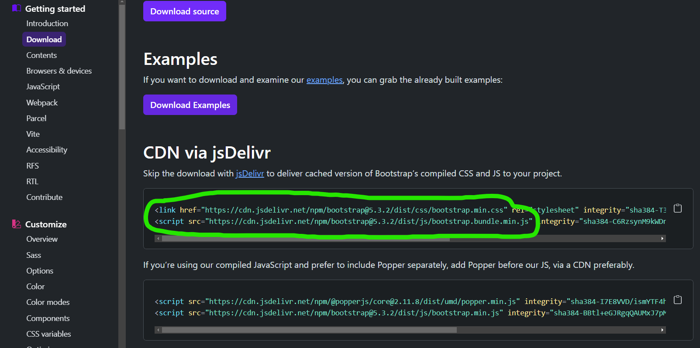

# Магазин
Сегодня мы начнем создавать свой магазин. <br>
Подумайте на какую тематику он будет.<br>
Для закрепления процесса создания проекта, сделаем новый проект.

1. ## Создание нового проекта и приложения `shop`
    Проект желательно называть `config`, так папка с <br>
    настройками синхронного, асинхронного серверов и <br>
    настройками проекта будет в папке с корректным названием `config`.<br>
    Приложение назовем `shop`.<br><br>
   
    Пусть ученики сами сделают это используя шпаргалку ([Старт проекта](https://github.com/xlartas/it-compot-backend-methods/blob/main/django-base.md#%D0%BF%D1%80%D0%BE%D1%81%D1%82%D0%BE%D0%B9-%D1%81%D1%82%D0%B0%D1%80%D1%82-%D0%BF%D1%80%D0%BE%D0%B5%D0%BA%D1%82%D0%B0))

2. ## Создание моделей
   Перейдем к созданию моделей в файле models.py вашего нового приложения.<br>
   Пусть ученики продумают, какие модели нужны для магазина и какие поля у них будут.<br><br>

   Заказ должен относится к определенному товару, поэтому мы будем использовать <br>
   специальное поле (`ForeignKey / Внешний ключ`) которое будет `ссылаться` на определенный объект модели `Product`.<br>
   В действительности в базе данных в этом поле будет лежать `primary_key`(в нашем случае `id`) связанного объекта.
   >Посмотрите как мы отображаем рейтинг на следующем занятии, 
   > это для слабых учеников будет сложно, поэтому чем слабее ученики тем меньше полей будет в их модели.
   ```python
   # shop/models.py
   class Product(models.Model):
       name = models.CharField(max_length=100)
       image = models.ImageField(upload_to='images/Product/')
       desc = models.TextField()
       price = models.FloatField()
       discount = models.PositiveIntegerField(default=0)
       rating = models.PositiveIntegerField()
       stock = models.PositiveIntegerField()  # в наличии кол-во
       is_available = models.BooleanField(default=True)
   
   class Order(models.Model):
       product = models.ForeignKey(Product, on_delete=models.SET_NULL, null=True)
       delivery_address = models.CharField(max_length=255)
       created_at = models.DateTimeField(auto_now_add=True)
   ```
   >Не забываем про миграции

3. ## Пропишем маршруты к media
    > Вспоминаем, что и зачем.
    ### Шпаргалка [MediaFiles](https://github.com/xlartas/it-compot-backend-methods/blob/main/django-base.md#Media-Files)

4. ## Создание представлений, шаблонов и маршрутов.
   Продумайте какие адреса и страницы у вас будут.
   * ### Создание шаблонов
      Cоздадим пока что пустые шаблоны HTML для каждой страницы. 
      ```sh
      shop/templates/shop/catalog.html
      shop/templates/shop/orders.html
      shop/templates/shop/order_create.html
      ```
     
   * ### Создание представлений (views)
     ```python
     # shop/views.py
     def catalog(request):
         # <h1>Каталог товаров</h1>
         return render(request, 'shop/catalog.html')
     
     def orders(request):
         # <h1>Заказы</h1>
         return render(request, 'shop/orders.html')
     
     def order_create(request):
         # <h1>Оформление заказа</h1>
         return render(request, 'shop/order_create.html')
     ```
    
   * ### Создание маршрутов
       Обратите внимание, что в прошлом проекты в `project_name/urls.py` собраны все маршруты до разных приложений.<br>
       Было бы гораздо лучше если бы у каждого приложения был свой urls.py, и это возможно.<br>
       Создайте файл `urls.py` в папке приложения shop и добавьте в него маршруты `catalog` `orders` `order_create`.
    
       ```python
       # shop/urls.py
        # импортируем все из файла shop/views.py. Ученики в теории должны сами это смочь сделать.
       from .views import * 
       
       urlpatterns = [
           path('', catalog, name='catalog'),
           path('orders/', orders, name='orders'),
           path('order_create/', order_create, name='order_create'),
       ]
       ```
       ####  Теперь, когда у нас есть свой файл shop/urls.py для приложения,<br>мы можем включить его в корневой файл urls.py проекта с помощью функции `include`.
       ```python
       # project_name/urls.py
       from django.urls import path, include
       urlpatterns = [
           ...,
           path('shop/', include('shop.urls')),  # включаем URL-адреса приложения shop
       ]
       # По итогу мы получим следующие адреса:
       # http://127.0.0.1:8000/shop/
       # http://127.0.0.1:8000/shop/orders/
       # http://127.0.0.1:8000/shop/order_create/
       ```
       >Здесь мы используем include для включения URL-адресов приложения shop в общие URL-адреса проекта, что позволяет нам организовывать URL-адреса более структурированно и читаемо.
     
5. ## Скопируйте базовый шаблон, шапку и футер по аналогии со старым проектом.
   Добавьте в `<head>` в `base.html` `bootstrap.bundle.min.js`,<br>
   заодно вспомним где брать `bootstrap` файлы.
   #### Это позволит работать js элементам bootstrap, <br> в частности бургер меню в шапке при ширине ниже 992px.
   > В документации bootstrap раздел Download.
   >  
   ```html
   <head>
       ...
       <script defer src=""></script>
   </head>
   <!-- defer значит, что файл будет загруже после загрузки всей страницы -->
   ```

> ### Если не успеете ничего страшного, на следующих 2-ух уроках будет время доделать.

## Подведите итоги.