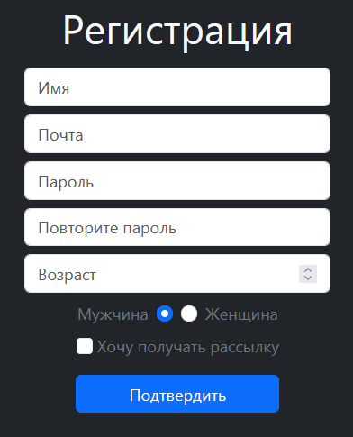

# Статические файлы, тэг form, bootstrap, git
Работа с сервером почти во всех случаях сопровождается обменом данных между клиентом и сервером
и сегодня мы научимся создавать форму для ввода пользовательских данных и отправлять их на сервер.
Для примера будем делать форму регистрации новых пользователей. В дальнейшем используем её когда 
будем работать с User в django.

1.  ## Делаем форму на новой странице регистрации.
    Рассказываем о разных видах input'ов и вообще о тэге form и его атрибутах.
    ```html
    <h1>Регистрация</h1>
    <form action="Если не писать, то отправка идёт на текущий адрес." method="get">
        <input type="text" placeholder="Имя" name="name">
        <input type="email" placeholder="Почта" name="email">
        <input type="password" placeholder="Пароль" name="password">
        <input type="password" placeholder="Повторите пароль" name="password_repeat">
        <span>Мужчина</span>
        <input class="form-check-input" type="radio" name="gender" id="male" value="male">
        <input class="form-check-input" type="radio" name="gender" id="female" value="female">
        <span>Женщина</span>
        <button type="submit">Подтвердить</button>
    </form>
    ```

2.  ## На этом этапе ученики скорее всего захотят стилизировать форму.
    *   ### Рассказываем и показываем что такое `bootstrap` и зачем он нужен.<br>
        Подключаем **[Bootstrap](https://cdn.jsdelivr.net/npm/bootstrap@5.3.1/dist/css/bootstrap.min.css)**.<br>
        >Можете использовать `link` со ссылкой выше или пойти в документацию и скопировать оттуда.
        Обязательно показываем, что это **обычный** css файл, чтобы они не пугались.
        ```html
        <head>
            <link rel="stylesheet" 
                  href="https://cdn.jsdelivr.net/npm/bootstrap@5.3.1/dist/css/bootstrap.min.css"> 
        </head>
        ```
        
        Обновляем страницу и видим, что уже что-то изменилось.<br>
        Начинаем стилизировать.
        >Я бы не рассказывал про сетку
        >на данном этапе, это не так просто для понимания даже для hard уровня, но если
        >в учениках уверены можно и рассказать или если время останется в конце.
        
    *   ### Покаываем второй раздел шпаргалки [Bootstrap base](https://github.com/xlartas/it-compot-backend-methods/)
        Обязательно рассказываем про часто используемые классы.
        К готовым элементам идти пока рано.
    
3.  ## Даем ученикам самим поприменять классы
    > Подсказываем ученикам

    По итогу должно получиться _**Примерно**_ это.
    
    
    >Естественно, если _**easy**_ убираем сложные поля и свойства. Это версия для _**Hard**_.
    
    ```html
    <!-- Я знаю, что нужно использовать label, но им это не нужно сейчас. -->
    <body class="bg-dark">
    <div class="mt-5">
        <h1 class="text-center text-light my-3">Регистрация</h1>
        <form class="d-flex flex-column gap-2 mx-auto"
              style="max-width: 300px;">
            <input class="form-control" type="text"
                   placeholder="Имя" name="name">
            <input class="form-control" type="email"
                   placeholder="Почта" name="email">
            <input class="form-control" type="password"
                   placeholder="Пароль" name="password">
            <input class="form-control" type="password"
                   placeholder="Повторите пароль" name="password_repeat">
            <input class="form-control" type="number"
                   placeholder="Возраст" name="age" min="10" max="200">
    
            <div class="text-secondary d-flex gap-2 justify-content-center">
                <span>Мужчина</span>
                <input class="form-check-input" type="radio" name="gender" id="male" value="male">
                <input class="form-check-input" type="radio" name="gender" id="female" value="female">
                <span>Женщина</span>
            </div>
    
            <div class="mx-auto">
                <input class="form-check-input" type="checkbox" name="sub_email">
                <span class="fs-6 text-secondary">Хочу получать рассылку</span>
            </div>
            <button style="max-width: 90%; min-width: 200px;"
                    class="btn btn-primary mx-auto my-2"
                    type="submit">Подтвердить
            </button>
        </form>
    </div>
    </body>
    ```
## Подведите итоги.