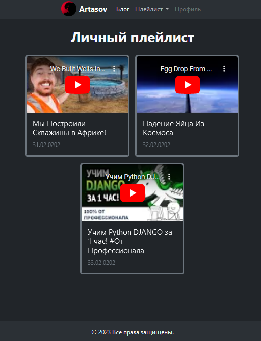

# Сохранение данных с клиента в БД и углубление в шаблонизацию.
В этом руководстве мы создадим новую страницу с формой для добавления 
видео в плейлист и постов в блог, научимся расширять шаблоны.
>

>А зачем нам страничка для добавления, если есть такая же в админке?"<br><br>
>***Если у нас будет много-пользовательское приложение, мы не сможем дать*** 
>***доступ в админку каждому пользователю.***

1. ## Создаем страничку с формой для добавления видео
   >Ученики должны справиться сами.
   ```html
   <!-- playlist/templates/playlist/video_create.html -->
   
   <h1 class="text-light text-center fw-bold my-4">Новое видео</h1>
   <form class="d-flex flex-column gap-2 mx-auto"
         style="max-width: 300px;">
       <input class="form-control" type="text"
              placeholder="Название" name="title">
       <input class="form-control" type="text"
              placeholder="Код вставки" name="embed_code">

       <button style="max-width: 90%; min-width: 200px;"
               class="btn btn-danger mx-auto my-2"
               type="submit">Добавить
       </button>
   </form>
   
   ```
   ```python
   # project_name/urls.py
   from . views import video_create
   urlpatterns = [
       ...
       path('video/new/', video_create, name='video_new'),
   ]
   ```
   ```python
   # playlist/views.py
   from .models import Video
   def video_create(request):
       return render(request, 'playlist/video_create.html')
   ```
2. ## Создание view для добавления видео

   * Показываем ученикам как создавать объекты в базе данных.<br>
   * Вспоминаем как получать данные из `request.POST`.<br>
   * Вспоминаем под какими именами мы передаем данные (*имена input в форме*). <br>
   * Даем время ученикам попробовать самим доделать view, 
   чтобы она смогла принимать нужные поля (`'title', 'embed_code'`) 
   и создавать по ним объект в DB, то есть обрабатывать и `GET` и `POST` запросы.<br>
   Пусть пробуют, задают вопросы и т.д.<br>
   * Через несколько минут, смотря по ситуации, показываем как должно выглядеть. <br>
   <br>
   
   **Обьясняем каждую строчку** <br>
   Доделываем до правильного варианта.
   ```python
   # playlist/views.py
   from .models import Video
   
   def video_create(request):
       if request.method == "POST":
           # Тут нужно использовать .get('key') вместо ['key'], 
           # но ученикам это рано использовать.
           # + будут видеть сразу ошибки в debug если что-то не верно.
           title = request.POST['title']
           embed_code = request.POST['embed_code']
           Video.objects.create(title=title, embed_code=embed_code)
       return render(request, 'playlist/video_create.html')
   ```
   Теперь, мы можем протестировать это.


3. ## Замечаем, что у нас повторяется на страницах одно и тоже
   ```html
   
   <!DOCTYPE html>
   <html lang="ru">
       <head>
           <meta http-equiv="Content-Type" content="text/html">
           <meta name="viewport" content="width=device-width, initial-">
           <meta charset="utf-8"/>
           <link type="text/css" rel="stylesheet"
                 href=""/>
           <title>Artasov</title>
       </head>
       <body class="bg-dark d-flex flex-column" style="min-height: 100vh;">
           
           <main class="my-4">
               ...
               ...
           </main>
           
       </body>
   </html>
   ```
4. ## Углубление в шаблонизацию
   Рассказываем, что есть возможность сделать `базовый шаблон`,
   куда мы можем `вынести эти повторящиеся части`, а дальше просто `расширять` 
   этот `базовый шаблон` другими фрагментами кода.
   Показываем пример, где в файле `base.html` создается общая 
   структура страницы, которую затем можно расширять 
   и переопределять в основных шаблонах.
   
   * Добавляем `project_root/app1/templates/base.html`
     >Помним, что bootstrap у нас лежит в самом первом приложении. 
      Давайте там же добавим базовый шаблон.
   * Напишем структуру объясняя и задавая вопросы.
     ```html
     <!-- Базовый шаблон project_root/app1/templates/base.html -->
     
     <!DOCTYPE html>
     <html lang="ru">
     <head>
         <meta http-equiv="Content-Type" content="text/html">
         <meta name="viewport" content="width=device-width, initial-">
         <meta charset="utf-8"/>
         <link type="text/css" rel="stylesheet"
               href=""/>
         <title>Artasov</title>
     </head>
     <body class="bg-dark d-flex flex-column" style="min-height: 100vh;">
         
         <main class="my-4">
             
         </main>
         
     </body>
     </html>
     ```
      Блоки `Content`, 
      мы сможем переопределять по надобности при расширении шаблона.<br><br>
   
   * Показываем пример наследования / расширения шаблона и начинаем переделывать
     все странички(`все посты`, `все видео`, `добавление видео`), ученики должны хорошо понять принцып этой логики.
     ```html
     <!-- Например страница со всеми постами blog/posts_list.html -->
     

     Блог | Все посты
     
     
         <h1 class="text-light text-center fw-bold">Посты</h1>
         <div class="posts_container d-flex gap-3 flex-wrap justify-content-center mx-auto" 
              style="max-width: 800px;">
             
                 
                     <div class="card" style="width: 250px;">
                         
                         <div class="card-body">
                             <h5 class="card-title">{{ post.title }}</h5>
                             <p class="card-text">{{ post.text }}</p>
                         </div>
                     </div>
                 
             
         </div>
     
     ```
### Скорее всего вы не успеете, поэтому как раз закрепите в начале следующего урока.

># git push...