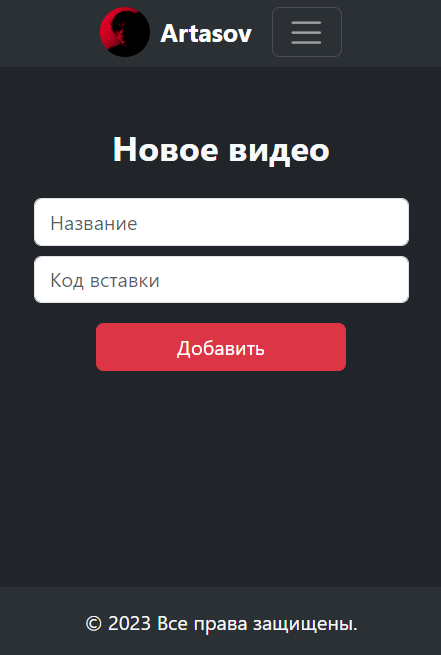

# Оценки на видео. Повторение.

В данной методичке, мы сделаем, чтобы на каждое видео можно было поставить лайк.
>Можете если хотите показать, что примерно мы будем делать.<br><br>


### Доделываем если не успели шаблоны с предыдущего урока, а если успели то повторяем хотя бы устно

## Оценки на видео
* ### Вспоминаем как мы отправляем данные на сервер. 
  Покажите на примере шпаргалки ([Обмен данными</u> клиент <--> сервер](https://github.com/xlartas/it-compot-backend-methods/blob/main/django-base.md#%D0%BE%D0%B1%D0%BC%D0%B5%D0%BD-%D0%B4%D0%B0%D0%BD%D0%BD%D1%8B%D0%BC%D0%B8-%D0%BA%D0%BB%D0%B8%D0%B5%D0%BD%D1%82----%D1%81%D0%B5%D1%80%D0%B2%D0%B5%D1%80)).

* ### Вместе думаем, как мы можем сделать функциональность лайков.
     * Где будем хранить количество лайков? _В модели **Post** в поле **likes**._<br>
     * Где будет кнопка отправки формы лайка? _В карточке поста._<br>
     * Мы же должны отправлять что-то, по чему мы сможем понять, <br>на какой пост был поставлен лайк. Что это? _post_id_<br>
     * Какой тип input будет использоваться для передачи post_id? _**hidden** с **id** поста. <br>Скажите посмотреть шпаргалку_ ([Виды input](https://github.com/xlartas/it-compot-backend-methods/blob/main/django-base.md#%D0%B2%D0%B8%D0%B4%D1%8B-%D0%BF%D0%BE%D0%BB%D0%B5%D0%B9-%D0%B2%D0%B2%D0%BE%D0%B4%D0%B0-input))<br>
     * Что будет кнопкой отправки? _Кнопка like._<br>

* ### Пусть ученики напишут сами.
  * #### Создадим новое поле `likes` в модели `Post`.    
    ```python
    # blog/models.py
    class Post(models.Model):
        ...
        likes = models.IntegerField(default=0)
    ```
    Мигрируем изменения модели в db<br>
    `python manage.py makemigrations`<br>
    `python manage.py migrate`<br><br>
  
  * #### Добавим кнопку лайка и количество лайков в карточку поста.
    ```html
    <!-- blog/posts_list.html-->
    
        <div class="card" style="width: 250px;">
            
            <div class="card-body">
                <h5 class="card-title">{{ post.title }}</h5>
                <p class="card-text">{{ post.text }}</p>
                <!-- Добавляем форму для отпарвки лайка с картинкой и отображаем текущее количество лайков.-->
                <form method="post" class="d-flex flex-row">
                    <!-- Скрытое поля для отправки id того поста, на лайк которого нажмем.-->
                    <input type="hidden" name="post_id" value="{{ post.id }}">
                    <button type="submit" class="bg-transparent border-0">
                        
                    </button>
                    <span class="text-secondary">{{ post.likes }}</span>
                </form> 
            </div>
        </div>
    
    ```
  * #### Добавим функцию обработчик лайка.
    Смотрим шпаргалку ([Изменение полей объекта](https://github.com/xlartas/it-compot-backend-methods/blob/main/django-base.md#orm))
    > Используем принты если, что-то не получается.
    ```python
    # blog/views.py
    def post_like(request):
        print('LIKE setter')
        if request.method == 'POST':
            post_id = request.POST['post_id']  # получаем id нужного поста
            post = Post.objects.get(id=post_id)  # получаем объект поста по его id
            post.likes = post.likes + 1  # post.likes += 1
            post.save()  # Сохраняем изменения
    ```
    ```python
    from blog.views import post_like
    urlpatterns = [
        ...
        path('blog/post_like/', post_like),
    ]
    ```    

  * #### Пробуем нажать на кнопку лайка.
    Страница просто перезагружается. Почему?<br>
    Возможно кто-то догадается в чем проблема.<br>
    _Форма отправляется не на тот адрес и соответственно обрабатывается не тем view_.<br>
    Вспоминаем, что существует артибут `action=""`.<br>
    Добавим его в форму.
    ```html
    <form action="http://127.0.0.1:8000/blog/post_like/" method="post" class="d-flex flex-row">
    ```
    Теперь форма отправляется куда нужно, лайк прибавляется,<br>
    но у нас не рендериться страница после отправки формы лайка,<br> 
    приходится вручную переходить на страницу постов.

> На следующем уроке мы доделаем ссылки для перехода на добавление видео, сделаем перенаправление после добавления лайка.

># git push...